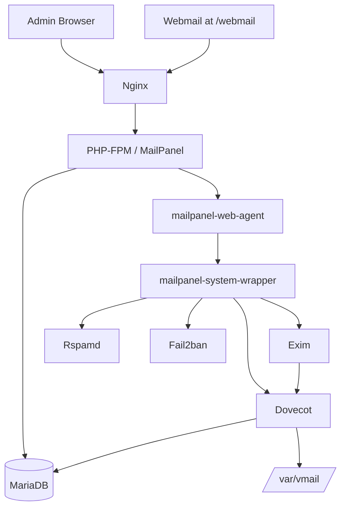
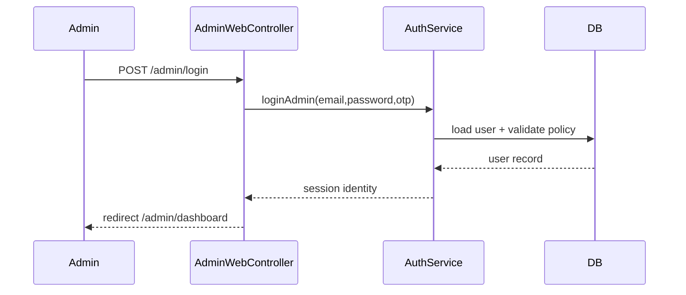
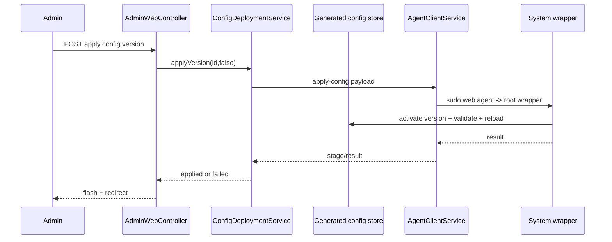

# Codebase Map

> Auto-generated from the current local tree plus verified live-server runtime notes. Last mapped: 2026-06-29T13:04:06Z

## System Overview

## Directory Structure

- `public/`
  - HTTP entrypoint and `/webmail` symlink mount
- `routes/`
  - `web.php` for admin UI
  - `api.php` for admin and mailbox APIs
- `src/Bootstrap/`
  - app wiring, DI, config loading
- `src/Core/`
  - request, response, router, database primitives
- `src/Security/`
  - session, CSRF, TOTP, RBAC, token guard
- `src/Repositories/Pdo/`
  - PDO-backed repositories per resource
- `src/Services/`
  - business services, renderers, deployment orchestration
- `src/Http/Controllers/`
  - admin web, admin API, auth, monitoring, security UI
- `src/Views/admin/`
  - layout, dashboard, CRUD pages, security pages
- `database/migrations/`
  - schema bootstrap and later security/auth additions
- `deploy/`
  - agent install, ACME sync, webmail wiring
- `tests/`
  - focused unit coverage for auth, routing, renderers, validators

## Module Guide

### Entry / Boot

**Purpose**: Start the PHP app and session securely.

- `public/index.php`
- `bootstrap/app.php`
- `src/Bootstrap/ApplicationFactory.php`

### Security Layer

**Purpose**: Resolve actors, enforce permissions, manage sessions and TOTP.

- `src/Security/SessionManager.php`
- `src/Security/CsrfService.php`
- `src/Security/AuthorizationService.php`
- `src/Security/RequestActorResolver.php`
- `src/Security/TokenGuard.php`
- `src/Security/TotpService.php`

### Admin Web Layer

**Purpose**: Render the admin console and handle form flows.

- `src/Http/Controllers/AdminWebController.php`
- `src/Http/Controllers/SecuritySystemController.php`
- `src/Http/Controllers/MonitorController.php`
- `src/Views/admin/layout.php`
- `src/Views/admin/pages/*.php`

### Admin API Layer

**Purpose**: Expose machine-friendly CRUD and config deployment endpoints.

- `src/Http/Controllers/AdminController.php`
- `routes/api.php`

### Mail Domain Logic

**Purpose**: CRUD and policy for tenants, domains, mailboxes, aliases, forwards, and groups.

- `src/Services/TenantService.php`
- `src/Services/DomainService.php`
- `src/Services/MailboxService.php`
- `src/Services/AliasService.php`
- `src/Services/ForwardService.php`
- `src/Services/MailGroupService.php`

### Config Rendering / Deployment

**Purpose**: Generate versioned configs, validate, apply, and roll back service configs.

- `src/Services/NginxConfigRenderer.php`
- `src/Services/EximConfigRenderer.php`
- `src/Services/DovecotConfigRenderer.php`
- `src/Services/RspamdConfigRenderer.php`
- `src/Services/Fail2banConfigRenderer.php`
- `src/Services/ConfigDeploymentService.php`
- `src/Services/AgentClientService.php`

## Data Flow

### Admin Login

### Config Apply

## Live Runtime Notes

- Canonical app root on live: `/opt/mailpanel`
- Canonical generated root on live: `/var/lib/mailpanel/generated`
- Live services verified listening: `25`, `80`, `443`, `465`, `587`, `993`, `995`, `4190`, `8686`
- Current drift found on live: Nginx was rewriting `/webmail` to the wrong upstream even though the webmail app still existed at its configured root

## Gotchas

- `src/Http/Controllers/AdminWebController.php` is large and mixes rendering with some direct SQL updates
- Several docs and templates still carry legacy webmail naming
- Some admin UI files still contain mojibake and need a broader UTF-8 cleanup pass
- `public/webmail` in the local Windows workspace is a symlink target placeholder, not bundled webmail source

## Navigation Guide

- To change auth/session behavior: `config/app.php`, `src/Security/*`, `src/Services/AuthService.php`
- To change tenant/domain/mailbox rules: `src/Services/*Service.php`, `src/Repositories/Pdo/*Repository.php`
- To change live config generation: `src/Services/*ConfigRenderer.php`
- To change admin UI shell: `src/Views/admin/layout.php`
- To change live webmail behavior: `config/mailpanel.php`, `deploy/install_webmail_stack.sh`, `src/Services/NginxConfigRenderer.php`, `src/Services/Fail2banConfigRenderer.php`
